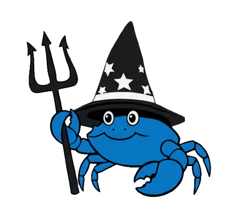
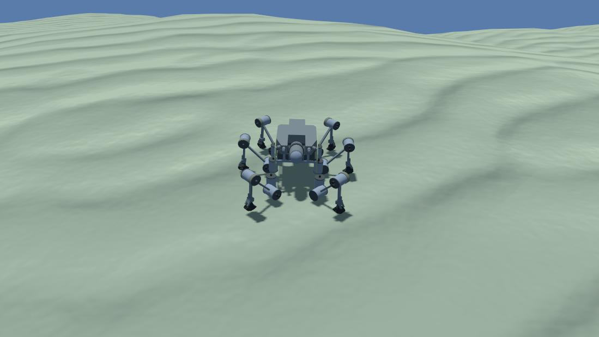
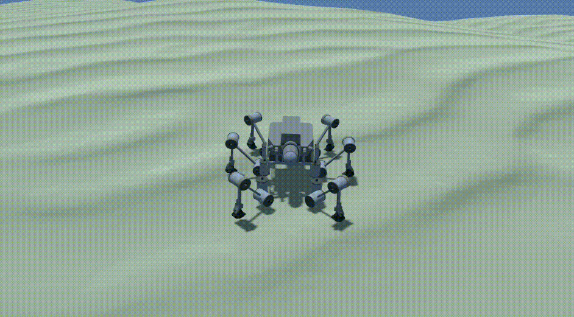

<div align="center">



# SILVER2 - Gazebo Simulation

**ROS 2 control integration testing using Gazebo Sim (formerly Ignition).**

[](LICENSE)
[](https://docs.ros.org/en/jazzy/)
[](https://gazebosim.org/home)

</div>

---

## 🌊 Overview

This repository provides the **Gazebo Sim 8 (Harmonic)** environment for the **SILVER2** robot. It is designed primarily for testing **ROS 2 Control** hardware interfaces and standard package integrations.



> ⚠️ **Note on Hydrodynamics:** > The standard Gazebo Sim hydrodynamics plugins can exhibit instability with complex articulated robots like SILVER2. This repository currently uses `gz-sim-hydrodynamics-system` with the Bullet physics engine for maximum stability, but users may experience solver jitters. For high-fidelity physics, please refer to our **Isaac Sim** or **Stonefish** repositories.

---

## 🚀 Key Features

* **ROS 2 Control:** Uses standard `ros2_control` hardware interfaces, making it ideal for testing middleware integration.
* **Modern Gazebo:** Built on the latest Gazebo Sim architecture.
* **Standardization:** Follows standard ROS package structures for easy deployment.

---

## 🎥 Gallery

### Gait Controller Simulation
Demonstration of the robot walking in the Gazebo environment.



---

## 🛠️ Installation & Usage

### 1. Prerequisites
Ensure you have a working ROS 2 Jazzy environment with:
* `ros-jazzy-ros-gz`
* `ros-jazzy-ros2-control` & `ros-jazzy-ros2-controllers`
* `ros-jazzy-gz-ros2-control`
* Python dependencies (`PyYAML`, `transforms3d`, `Cython`) in a virtual environment (`venv`).

### 2. Launch the Simulation
This launches the Gazebo physics server, spawns the robot, and opens RViz.

```bash
# Navigate to workspace
cd ~/PathToWorkspace/silver2_gz

# Activate Python venv
source venv/bin/activate

# Source ROS 2 and workspace
source /opt/ros/jazzy/setup.bash
source install/setup.bash

# Launch simulation
ros2 launch silver sim.launch.py
```

### 3. Control the Robot
To drive the robot, open a **second terminal**.

```bash
# Activate venv
source ~/PathToWorkspace/silver2_gz/venv/bin/activate

# Source ROS 2
source ~/PathToWorkspace/silver2_gz/install/setup.bash

# Run keyboard teleop
ros2 run teleop_twist_keyboard teleop_twist_keyboard
```
Use keys ```i```, ```j```, ```k```, ```l``` to move the robot.

---

## 🦀 The SILVER2 Project

SILVER2 is a bio-inspired robot designed for low-impact seabed interaction. This Stonefish environment is part of a larger ecosystem of simulation tools.

**Check out our other simulators:**
* **Isaac Sim Repo:** [Joagai23/silver2_isaacsim](https://github.com/Joagai23/silver2_isaacsim)
* **Stonefish Repo:** [Joagai23/silver2_stonefish](https://github.com/Joagai23/silver2_stonefish)

### Acknowledgements
The project is carried out within the framework of the activities of the Spanish Government through the “Severo Ochoa Centre of Excellence” granted to ICM-CSIC (CEX2024-001494-S) and the Research Unit Tecnoterra (ICM-CSIC/UPC).

This project is supported by the Horizon Europe [**MERLIN Project**](https://merlin-project.org/) [grant number GAP-01189796] and [**Blue Project**](https://www.blue-project.eu/) [grant number 101061354].

<div align="center">


<sub><i>"Magic happens at the bottom of the sea."</i></sub> </div>
