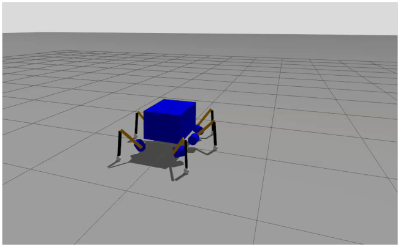
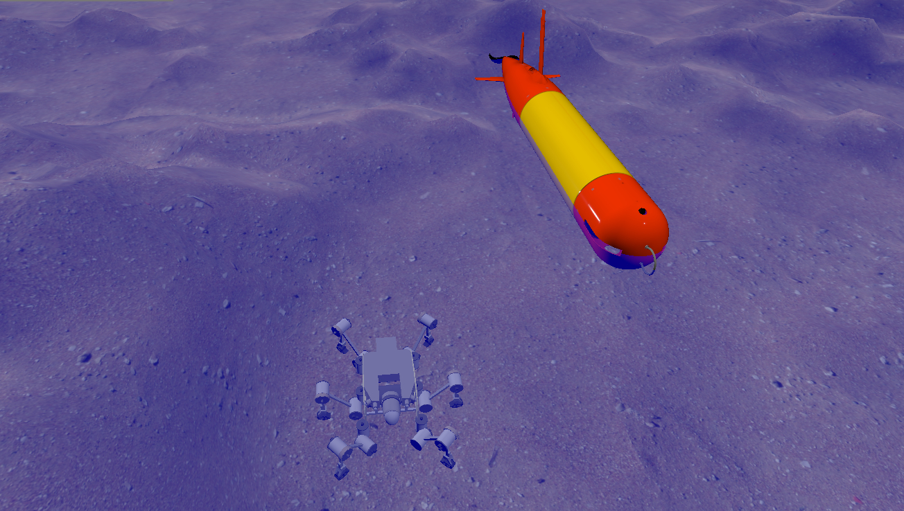

# Silver2 Gazebo Simulation
This is a ROS 2 Jazzy and Gazebo Sim repository for the control and simulation of the underwater legged robot SILVER2.

*May 2025: Initial Prototype*



*June 2025: Final Result*



## User Guide
Welcome to the Silver hexapod underwater simulation! This guide provides step-by-step instructions for launching the Gazebo simulation and controlling the robot's movement using your keyboard.

### Prerequisites
Before you begin, ensure you have a complete and working ROS 2 Jazzy environment with all the necessary packages for this project installed, including:

- ROS 2 Jazzy Desktop

- Gazebo for ROS 2 (```ros-jazzy-ros-gz```).

- ROS 2 Control packages (```ros-jazzy-ros2-controllers```, ```ros-jazzy-ros2-control```, ```ros-jazzy-controller-manager```, ```ros-jazzy-control-toolbox```).

- ROS 2 Gazebo Control packages (```ros-jazzy-gz-ros2-control```).

- A successfully built ```silver2_gz``` workspace.

- A configured Python virtual environment (```venv```) with all required libraries (```PyYAML```, ```transforms3d```, ```Cython```).

#### Step 1: Launch the Simulation Server
This step starts the main Gazebo physics simulation and all the necessary robot controllers. The process opens the Gazebo Simulator and RVIZ as a result of a successful deployment.

1. **Open a new terminal.**
2. **Run the Setup Commands:** Copy and paste the entire block below into your terminal. This will navigate to your workspace, activate the Python virtual environment, and set up the ROS 2 environment before launching the simulation.
    ```
    # Navigate to your workspace
    cd ~/PathToWorkspace/silver2_gz

    # Activate your Python virtual environment
    source venv/bin/activate

    # Source the ROS 2 environment and your workspace
    source /opt/ros/jazzy/setup.bash
    source install/setup.bash

    # Launch the simulation
    ros2 launch silver sim.launch.py
    ```
Leave this terminal running. It is now hosting your simulation world.

#### Step 2: Control the Robot with Your Keyboard
To actually drive the robot, you need to run a second program that translates your keystrokes into velocity commands.

1. **Open a SECOND, separate terminal.**

2. **Run the Setup Commands for the Controller:** Just like before, you need to set up the environment in this new terminal. Copy and paste the entire block below.
    ```
    # Activate your Python virtual environment
    source ~/PathToWorkspace/silver2_gz/venv/bin/activate

    # Source the ROS 2 environment
    source ~/PathToWorkspace/silver2_gz/install/setup.bash

    # Run the keyboard teleop node
    ros2 run teleop_twist_keyboard teleop_twist_keyboard
    ```
3. **Drive the Robot:** The terminal will now display instructions for controlling the robot. Make sure this second terminal window is active (clicked on) and use the keys (e.g., ```i```, ```j```, ```k```, ```l```) to move the robot around in the simulation.

You have now successfully launched and are controlling the Silver hexapod!